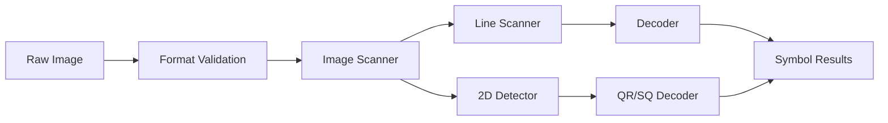

ZBar's image scanning engine analyzes images to locate and decode barcodes. This page explains the scanning pipeline, image requirements, and performance optimization strategies.

## The Scanning Pipeline

The image scanner follows a multi-stage pipeline to transform raw image data into decoded symbols:



### Pipeline Components

<CardGroup cols={3}>
  <Card title="Image Scanner" icon="image">
    Orchestrates the scanning process, managing scan lines and collecting results
  </Card>
  
  <Card title="Line Scanner" icon="wave-square">
    Extracts intensity profiles and detects bar/space patterns
  </Card>
  
  <Card title="Decoder" icon="binary">
    Interprets bar/space widths to extract encoded data
  </Card>
</CardGroup>

## Image Format Requirements

### Required Formats

ZBar's image scanner **only accepts grayscale images** in one of these formats:

- **Y800** - 8-bit grayscale (preferred)
- **GREY** - 8-bit grayscale (alternative spelling)

```c
// Check image format before scanning
unsigned long format = zbar_image_get_format(image);
if (format != fourcc('Y','8','0','0') && 
    format != fourcc('G','R','E','Y')) {
    // Convert to grayscale first
    zbar_image_t *gray = zbar_image_convert(image, 
                                             fourcc('Y','8','0','0'));
    zbar_scan_image(scanner, gray);
    zbar_image_destroy(gray);
} else {
    zbar_scan_image(scanner, image);
}
```

<Warning>
**Critical:** The scanner will return NULL if the image is not in grayscale format. Always convert color images before scanning.
</Warning>

### Format Conversion

ZBar provides built-in format conversion for common image formats:

```c
// Convert RGB to grayscale
zbar_image_t *gray = zbar_image_convert(rgb_image, 
                                        fourcc('Y','8','0','0'));

// Convert and resize
zbar_image_t *resized = zbar_image_convert_resize(image,
                                                    fourcc('Y','8','0','0'),
                                                    640, 480);
```

<Info>Format conversion uses simple averaging for RGB to grayscale: `Y = (R + G + B) / 3`</Info>

## Image Quality Considerations

Image quality directly impacts detection success rates. Key factors include:

### Resolution and Size

**Minimum Requirements:**
- 1D barcodes: At least 3-4 pixels per module (bar width)
- 2D barcodes (QR): At least 3-4 pixels per module
- Recommended: 5+ pixels per module for reliable detection

```c
// Example: For a 1mm module width
// At 300 DPI: 300/25.4 ≈ 12 pixels/mm (good)
// At 150 DPI: 150/25.4 ≈ 6 pixels/mm (marginal)
// At 72 DPI: 72/25.4 ≈ 3 pixels/mm (minimum)
```

<Tip>
For print-and-scan applications, use at least 300 DPI for reliable results.
</Tip>

### Contrast and Lighting

**Requirements:**
- Clear distinction between dark bars and light spaces
- Minimum contrast ratio: 3:1 (recommended: 5:1+)
- Even lighting across barcode area
- Avoid glare, shadows, or specular reflections

```c
// No direct contrast control, but you can test with inverted images
zbar_image_scanner_set_config(scanner, 0, 
                              ZBAR_CFG_TEST_INVERTED, 1);
```

### Focus and Sharpness

- Barcodes should be in focus
- Avoid motion blur
- Minimal JPEG compression artifacts
- Sharp edges on bars

<Note>
Blurry images may still decode if bars are distinguishable, but reliability decreases.
</Note>

### Orientation and Skew

**1D Barcodes:**
- Can tolerate moderate rotation (±45°)
- Scanner performs multi-angle line scans
- Best results when barcode is roughly horizontal or vertical

**2D Barcodes:**
- QR codes can be read at any orientation
- Finder patterns enable automatic rotation detection
- Some perspective distortion is tolerated

## The Scanning Process

### Scan Line Generation

The image scanner creates a grid of scan lines across the image:

<Steps>
  <Step title="Horizontal Scan Lines">
    Scanner generates horizontal lines based on `ZBAR_CFG_Y_DENSITY`:
    
    ```c
    // Density = 1: scan every line
    // Density = 2: scan every other line  
    // Density = N: scan every Nth line
    zbar_image_scanner_set_config(scanner, 0, 
                                  ZBAR_CFG_Y_DENSITY, 1);
    ```
    
    Lines are scanned bidirectionally (left-to-right, then right-to-left) for efficiency.
  </Step>
  
  <Step title="Vertical Scan Lines">
    Scanner generates vertical lines based on `ZBAR_CFG_X_DENSITY`:
    
    ```c
    zbar_image_scanner_set_config(scanner, 0, 
                                  ZBAR_CFG_X_DENSITY, 1);
    ```
    
    Like horizontal scans, these run bidirectionally (top-to-bottom, bottom-to-top).
  </Step>
  
  <Step title="Border Handling">
    Scanner automatically centers the scan pattern and adds quiet zone borders:
    
    ```c
    // Border calculation from img_scanner.c:927
    int border = (((img->crop_h - 1) % density) + 1) / 2;
    if (border > img->crop_h / 2)
        border = img->crop_h / 2;
    ```
    
    This ensures adequate quiet zones around barcodes.
  </Step>
</Steps>

### Scan Density Configuration

Scan density controls the trade-off between speed and detection capability:

<Tabs>
  <Tab title="High Density (1)">
    ```c
    zbar_image_scanner_set_config(scanner, 0, ZBAR_CFG_X_DENSITY, 1);
    zbar_image_scanner_set_config(scanner, 0, ZBAR_CFG_Y_DENSITY, 1);
    ```
    
    **Characteristics:**
    - Scans every line in both directions
    - Best detection for small or damaged barcodes
    - Slower processing time
    - Recommended for single-image scanning
    
    **Use When:**
    - Image quality is poor
    - Barcodes are small relative to image size
    - Maximum reliability is required
    - Processing time is not critical
  </Tab>
  
  <Tab title="Medium Density (2-4)">
    ```c
    zbar_image_scanner_set_config(scanner, 0, ZBAR_CFG_X_DENSITY, 2);
    zbar_image_scanner_set_config(scanner, 0, ZBAR_CFG_Y_DENSITY, 2);
    ```
    
    **Characteristics:**
    - Skips lines for faster processing
    - Good balance of speed and reliability
    - Suitable for most applications
    - Default configuration
    
    **Use When:**
    - Real-time video processing
    - Good image quality
    - Moderate barcode size
    - Balanced performance needed
  </Tab>
  
  <Tab title="Low Density (5+)">
    ```c
    zbar_image_scanner_set_config(scanner, 0, ZBAR_CFG_X_DENSITY, 5);
    zbar_image_scanner_set_config(scanner, 0, ZBAR_CFG_Y_DENSITY, 5);
    ```
    
    **Characteristics:**
    - Minimal scan lines
    - Fastest processing
    - May miss small barcodes
    - Best for large, high-quality barcodes
    
    **Use When:**
    - High-resolution images
    - Large barcodes
    - Performance is critical
    - Multiple frames available (video)
  </Tab>
</Tabs>

<Info>
**Default:** Both X and Y density are set to 1 for maximum reliability.
</Info>

### Intensity Scanning

For each scan line, the scanner:

1. **Extracts pixel intensities** along the line
2. **Detects edges** between bars and spaces
3. **Measures widths** of bars and spaces
4. **Feeds width data** to the decoder

```c
// From img_scanner.c:946 (simplified)
while (x < cx1) {
    uint8_t intensity = *pixel_ptr;
    movedelta(1, 0);
    zbar_scan_y(scanner, intensity);
}
```

The scanner uses adaptive thresholding to distinguish bars from spaces, accounting for varying lighting conditions.

## 2D Barcode Detection

### QR Code Detection

QR codes use a different detection approach:

<Steps>
  <Step title="Finder Pattern Detection">
    Scanner looks for the characteristic 1:1:3:1:1 ratio pattern that forms QR code position markers.
    
    ```c
    // Finder patterns are detected during line scanning
    // Pattern: black-white-black-white-black with 1:1:3:1:1 ratio
    ```
  </Step>
  
  <Step title="Timing Pattern Analysis">
    Once finder patterns are located, timing patterns between them are analyzed to determine module size and grid alignment.
  </Step>
  
  <Step title="Grid Extraction">
    The full QR code grid is extracted based on the detected patterns.
  </Step>
  
  <Step title="Error Correction Decoding">
    Reed-Solomon error correction is applied to recover data even from damaged codes.
  </Step>
</Steps>

<Note>
QR code detection is enabled automatically when `ZBAR_QRCODE` is enabled (default). No special configuration needed.
</Note>

## Crop Region Support

You can limit scanning to a specific region of the image:

```c
// Scan only a 200x200 region starting at (100, 100)
zbar_image_set_crop(image, 100, 100, 200, 200);
zbar_scan_image(scanner, image);

// Reset to full image
unsigned width, height;
zbar_image_get_size(image, &width, &height);
zbar_image_set_crop(image, 0, 0, width, height);
```

**Benefits:**
- Faster processing (fewer pixels to scan)
- Reduce false positives from irrelevant areas
- Focus on known barcode locations

<Tip>
Use crop regions when you know approximately where barcodes appear in your images.
</Tip>

## Result Caching and Filtering

### Inter-Image Result Cache

The result cache filters duplicate detections across consecutive images:

```c
// Enable cache (useful for video streams)
zbar_image_scanner_enable_cache(scanner, 1);

// Disable cache (for independent images)
zbar_image_scanner_enable_cache(scanner, 0);
```

**How It Works:**

<Accordion title="Cache Behavior">
  The cache implements hysteresis to prevent repeated reporting:
  
  - **Proximity window:** 1000ms - symbols detected within this time are considered "nearby"
  - **Hysteresis:** 2000ms - symbols must be absent this long before reporting again
  - **Timeout:** 4000ms - cache entries older than this are discarded
  
  ```c
  // From img_scanner.c:62-71
  #define CACHE_PROXIMITY 1000   /* ms */
  #define CACHE_HYSTERESIS 2000  /* ms */
  #define CACHE_TIMEOUT (CACHE_HYSTERESIS * 2)  /* ms */
  ```
  
  **Cache Count Interpretation:**
  - `< 0` - Symbol is still uncertain (needs more frames)
  - `= 0` - Symbol is newly verified (report this)
  - `> 0` - Duplicate symbol (suppress)
</Accordion>

<Warning>
**Important:** Disable cache when scanning independent images. It's designed for video streams where consecutive frames may contain the same barcode.
</Warning>

### Quality Filtering

The scanner automatically filters low-quality results:

```c
// From img_scanner.c:1057
if ((sym->type == ZBAR_CODABAR || filter) && sym->quality < 4) {
    // Symbol is recycled (not reported)
}
```

**Quality Metric:**
- Based on decode consistency across multiple scan lines
- Higher values indicate more consistent decodes
- Minimum quality threshold prevents false positives

## Inverted Image Detection

ZBar can automatically retry scanning with inverted pixel values:

```c
// Enable inverted detection (white bars on black background)
zbar_image_scanner_set_config(scanner, 0, 
                              ZBAR_CFG_TEST_INVERTED, 1);
```

**Behavior:**
1. Scan image normally
2. If no symbols found, invert all pixel values
3. Scan inverted image
4. Return results from either scan

<Note>
Inverted scanning doubles processing time when no barcodes are found, but enables detection of reverse-polarity barcodes.
</Note>

## Performance Optimization

### Optimization Strategies

<AccordionGroup>
  <Accordion title="Reduce Scan Density" icon="gauge">
    ```c
    // Scan every 3rd line instead of every line
    zbar_image_scanner_set_config(scanner, 0, ZBAR_CFG_X_DENSITY, 3);
    zbar_image_scanner_set_config(scanner, 0, ZBAR_CFG_Y_DENSITY, 3);
    ```
    
    **Impact:** ~9x faster (with density 3 in both dimensions)
  </Accordion>
  
  <Accordion title="Disable Unused Symbologies" icon="filter">
    ```c
    // Disable all
    zbar_image_scanner_set_config(scanner, 0, ZBAR_CFG_ENABLE, 0);
    
    // Enable only what you need
    zbar_image_scanner_set_config(scanner, ZBAR_CODE128, 
                                  ZBAR_CFG_ENABLE, 1);
    zbar_image_scanner_set_config(scanner, ZBAR_QRCODE, 
                                  ZBAR_CFG_ENABLE, 1);
    ```
    
    **Impact:** Reduces false positives and CPU usage
  </Accordion>
  
  <Accordion title="Use Crop Regions" icon="crop">
    ```c
    // Scan only center 50% of image
    unsigned w, h;
    zbar_image_get_size(image, &w, &h);
    zbar_image_set_crop(image, w/4, h/4, w/2, h/2);
    ```
    
    **Impact:** 4x faster (50% width × 50% height)
  </Accordion>
  
  <Accordion title="Downscale Large Images" icon="compress">
    ```c
    // Resize 4K image to 720p before scanning
    zbar_image_t *resized = zbar_image_convert_resize(
        image, fourcc('Y','8','0','0'), 1280, 720);
    zbar_scan_image(scanner, resized);
    ```
    
    **Impact:** Dramatic speedup for high-res images
  </Accordion>
  
  <Accordion title="Reuse Scanner Objects" icon="recycle">
    ```c
    // Create scanner once
    zbar_image_scanner_t *scanner = zbar_image_scanner_create();
    
    // Reuse for multiple images
    for (int i = 0; i < num_images; i++) {
        zbar_image_scanner_recycle_image(scanner, images[i]);
        zbar_scan_image(scanner, images[i]);
    }
    
    // Clean up once
    zbar_image_scanner_destroy(scanner);
    ```
    
    **Impact:** Avoids allocation overhead
  </Accordion>
</AccordionGroup>

### Performance Benchmarks

<CardGroup cols={2}>
  <Card title="High Quality" icon="star">
    **Configuration:**
    - X/Y Density: 1
    - All symbologies enabled
    - Inverted detection: ON
    
    **Performance:**
    - ~50-100ms per frame (VGA)
    - Maximum reliability
    - Best for single images
  </Card>
  
  <Card title="Balanced" icon="balance-scale">
    **Configuration:**
    - X/Y Density: 2
    - Common symbologies only
    - Inverted detection: OFF
    
    **Performance:**
    - ~15-30ms per frame (VGA)
    - Good reliability
    - Suitable for video
  </Card>
  
  <Card title="High Speed" icon="bolt">
    **Configuration:**
    - X/Y Density: 4-5
    - 1-2 symbologies only
    - Reduced resolution
    
    **Performance:**
    - ~5-10ms per frame (VGA)
    - Lower reliability
    - High-FPS video
  </Card>
  
  <Card title="2D Only" icon="qrcode">
    **Configuration:**
    - QR code only
    - Moderate density
    - Good lighting
    
    **Performance:**
    - ~20-40ms per frame (VGA)
    - Good for QR-only apps
    - Mobile-friendly
  </Card>
</CardGroup>

<Note>
Benchmarks are approximate and vary based on image content, CPU, and barcode location.
</Note>

## Complete Scanning Example

```c
#include <zbar.h>

int scan_image_file(const char *filename) {
    // Create scanner
    zbar_image_scanner_t *scanner = zbar_image_scanner_create();
    
    // Configure scanner
    zbar_image_scanner_set_config(scanner, 0, ZBAR_CFG_ENABLE, 0);
    zbar_image_scanner_set_config(scanner, ZBAR_CODE128, 
                                  ZBAR_CFG_ENABLE, 1);
    zbar_image_scanner_set_config(scanner, ZBAR_QRCODE, 
                                  ZBAR_CFG_ENABLE, 1);
    
    // Set scan density for speed
    zbar_image_scanner_set_config(scanner, 0, ZBAR_CFG_X_DENSITY, 2);
    zbar_image_scanner_set_config(scanner, 0, ZBAR_CFG_Y_DENSITY, 2);
    
    // Load and convert image (using ImageMagick or similar)
    zbar_image_t *image = load_image(filename);
    zbar_image_t *gray = zbar_image_convert(image, 
                                            fourcc('Y','8','0','0'));
    
    // Scan the image
    int n = zbar_scan_image(scanner, gray);
    
    if (n > 0) {
        // Process results
        const zbar_symbol_t *sym = zbar_image_first_symbol(gray);
        for (; sym; sym = zbar_symbol_next(sym)) {
            zbar_symbol_type_t type = zbar_symbol_get_type(sym);
            const char *data = zbar_symbol_get_data(sym);
            printf("Found %s: %s\n", 
                   zbar_get_symbol_name(type), data);
        }
    }
    
    // Clean up
    zbar_image_destroy(gray);
    zbar_image_destroy(image);
    zbar_image_scanner_destroy(scanner);
    
    return n;
}
```

## Related Resources

- [Barcode Types](/concepts/barcode-types) - Supported symbologies
- [Video Capture](/concepts/video-capture) - Real-time scanning from camera
- [API Reference](/api/image-scanner) - Complete API documentation