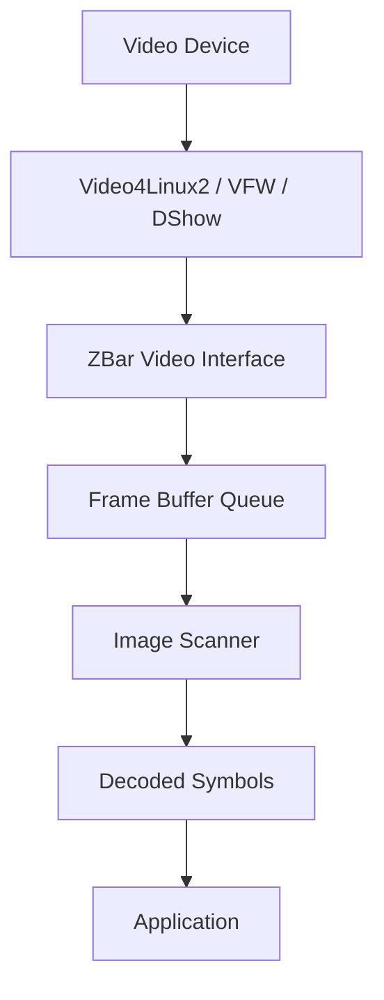

ZBar provides video capture capabilities to scan barcodes from cameras and video devices in real-time. This page covers video device integration, frame processing, and optimization for live barcode scanning.

## Video Capture Architecture

ZBar's video interface provides a platform-independent abstraction layer for capturing frames from video devices:



<CardGroup cols={3}>
  <Card title="Video Abstraction" icon="video">
    Platform-independent video capture API
  </Card>
  
  <Card title="Frame Management" icon="layer-group">
    Efficient buffer queue with zero-copy support
  </Card>
  
  <Card title="Format Negotiation" icon="handshake">
    Automatic format selection and conversion
  </Card>
</CardGroup>

## Platform Support

ZBar supports multiple video capture interfaces:

<Tabs>
  <Tab title="Linux - V4L2">
    **Video4Linux2** is the primary video capture API on Linux systems.
    
    **Features:**
    - Modern kernel interface (Linux 2.6.16+)
    - Memory-mapped I/O for zero-copy
    - Userspace buffer support
    - Extensive device control
    
    **Recommended:** Linux kernel 3.16 or later for full support
    
    ```c
    // Open V4L2 device
    zbar_video_t *video = zbar_video_create();
    zbar_video_open(video, "/dev/video0");
    ```
    
    <Info>
    V4L2 is part of the Linux kernel and available on most distributions. More info at [LinuxTV.org](http://www.linuxtv.org/wiki/).
    </Info>
  </Tab>
  
  <Tab title="Linux - V4L1">
    **Video4Linux v1** is the legacy video interface.
    
    **Status:** Deprecated but still supported for older systems
    
    **Limitations:**
    - Read-only I/O (no mmap support)
    - Limited device control
    - Slower performance
    
    <Warning>
    V4L1 support may be removed in future versions. Upgrade to V4L2 if possible.
    </Warning>
  </Tab>
  
  <Tab title="Windows - DirectShow">
    **DirectShow (DShow)** is the recommended video API for Windows.
    
    **Features:**
    - Native Windows video capture
    - Wide device compatibility
    - Filter graph architecture
    
    ```c
    // Windows: Use device path from DirectShow
    zbar_video_open(video, "@device_pnp_\\\\?\\usb#...");
    ```
  </Tab>
  
  <Tab title="Windows - VFW">
    **Video for Windows (VFW)** is the legacy Windows API.
    
    **Status:** Supported for compatibility
    
    **Limitations:**
    - Older API (Windows 9x era)
    - Limited format support
    - Use DirectShow when available
  </Tab>
</Tabs>

## Video Device Workflow

<Steps>
  <Step title="Create Video Object">
    Initialize the video capture object:
    
    ```c
    zbar_video_t *video = zbar_video_create();
    if (!video) {
        fprintf(stderr, "Failed to create video object\n");
        return -1;
    }
    ```
  </Step>
  
  <Step title="Configure Device (Optional)">
    Set preferences before opening the device:
    
    ```c
    // Request specific resolution
    zbar_video_request_size(video, 640, 480);
    
    // Request V4L2 interface
    zbar_video_request_interface(video, 2);
    
    // Request mmap I/O mode
    zbar_video_request_iomode(video, 2);
    ```
    
    <Note>
    Configuration requests are hints - the driver may ignore them or adjust values.
    </Note>
  </Step>
  
  <Step title="Open Device">
    Open and probe the video device:
    
    ```c
    // Linux: device node path
    if (zbar_video_open(video, "/dev/video0") < 0) {
        fprintf(stderr, "Failed to open video device\n");
        return -1;
    }
    
    // Windows: device path from enumeration
    // zbar_video_open(video, "@device_path");
    ```
    
    Opening the device probes available formats and resolutions.
  </Step>
  
  <Step title="Initialize Format">
    Select and initialize the video format:
    
    ```c
    // Automatic format negotiation
    zbar_video_init(video, fourcc('Y','8','0','0'));
    
    // Or negotiate with window
    zbar_negotiate_format(video, window);
    ```
    
    <Info>
    Use `fourcc('Y','8','0','0')` for grayscale - the best format for barcode scanning.
    </Info>
  </Step>
  
  <Step title="Enable Capture">
    Start streaming video frames:
    
    ```c
    if (zbar_video_enable(video, 1) < 0) {
        fprintf(stderr, "Failed to enable video\n");
        return -1;
    }
    ```
    
    The device begins capturing frames into the buffer queue.
  </Step>
  
  <Step title="Capture Frames">
    Retrieve and process frames:
    
    ```c
    while (running) {
        zbar_image_t *image = zbar_video_next_image(video);
        if (!image) {
            fprintf(stderr, "Frame capture error\n");
            break;
        }
        
        // Scan for barcodes
        zbar_scan_image(scanner, image);
        
        // Process results...
        
        // Release frame back to queue
        zbar_image_destroy(image);
    }
    ```
  </Step>
  
  <Step title="Clean Up">
    Disable capture and close device:
    
    ```c
    zbar_video_enable(video, 0);
    zbar_video_destroy(video);
    ```
  </Step>
</Steps>

## Video I/O Modes

ZBar supports three I/O modes for frame transfer:

<Tabs>
  <Tab title="Memory Mapped (MMAP)">
    **Recommended mode** - Zero-copy frame access
    
    ```c
    // Request mmap mode
    zbar_video_request_iomode(video, 2);
    ```
    
    **How it works:**
    - Kernel allocates frame buffers
    - Buffers are mapped into user space
    - No memory copying required
    - Direct access to device memory
    
    **Advantages:**
    - Highest performance
    - Lowest CPU usage
    - Reduced latency
    
    **Requirements:**
    - V4L2 interface
    - Driver mmap support
  </Tab>
  
  <Tab title="User Pointer (USERPTR)">
    Application-allocated buffers (V4L2 only)
    
    ```c
    // Request userptr mode
    zbar_video_request_iomode(video, 3);
    ```
    
    **How it works:**
    - Application allocates buffers
    - Pointers passed to driver
    - Driver DMAs directly to user buffers
    
    **Advantages:**
    - Control over buffer allocation
    - Good performance
    - Memory flexibility
    
    **Use cases:**
    - Special memory requirements
    - Buffer pool management
    - Integration with other systems
  </Tab>
  
  <Tab title="Read/Write">
    Standard system calls (fallback mode)
    
    ```c
    // Request read/write mode
    zbar_video_request_iomode(video, 1);
    ```
    
    **How it works:**
    - Uses `read()` system call
    - Data copied from kernel to user space
    - Simple but slower
    
    **Disadvantages:**
    - Extra memory copy
    - Higher CPU usage
    - Increased latency
    
    **When used:**
    - V4L1 devices
    - Drivers without mmap support
    - Automatic fallback
  </Tab>
</Tabs>

<Tip>
Always prefer mmap mode for best performance. Use `iomode = 0` (auto-detect) to let ZBar choose the best available mode.
</Tip>

## Frame Buffer Management

ZBar maintains a queue of frame buffers for efficient video processing:

### Buffer Queue Architecture

```c
// From video.h:41-42
#define ZBAR_VIDEO_IMAGES_MAX 4

struct zbar_video_s {
    // ...
    zbar_mutex_t qlock;        // Lock image queue
    int num_images;            // Number of allocated images  
    zbar_image_t **images;     // Indexed list of images
    zbar_image_t *nq_image;    // Last image enqueued
    zbar_image_t *dq_image;    // First image to dequeue
    zbar_image_t *shadow_image; // Internal double buffering
    // ...
};
```

**Buffer States:**

<Steps>
  <Step title="Allocated">
    Frame buffer is allocated and owned by video object
  </Step>
  
  <Step title="Queued">
    Buffer is queued to device driver for capture
  </Step>
  
  <Step title="Filled">
    Driver has filled buffer with frame data
  </Step>
  
  <Step title="Dequeued">
    Application has retrieved frame via `zbar_video_next_image()`
  </Step>
  
  <Step title="Released">
    Application calls `zbar_image_destroy()` to return buffer
  </Step>
</Steps>

### Frame Caching

For read/write mode, ZBar implements shadow buffering:

```c
video->shadow_image; // Special case internal double buffering
```

**Purpose:** Allows application to process a frame while the next frame is being read into an alternate buffer.

<Note>
Shadow buffering is only used for read-based I/O. Memory-mapped mode doesn't need it since buffers can be accessed directly.
</Note>

## Format Negotiation

ZBar supports various video formats and can convert between them:

### Native Formats

**Grayscale (Preferred):**
- `Y800` / `GREY` - 8-bit grayscale (best for scanning)
- Direct scanning, no conversion needed

**Color Formats:**
- `RGB3` / `BGR3` - 24-bit RGB
- `RGB4` / `BGR4` - 32-bit RGB
- `YUV` variants - YUV color space
- `JPEG` - Motion JPEG (with libjpeg)

### Format Selection

ZBar automatically selects the best format:

```c
// Preferred formats (in order):
// 1. Y800/GREY - native grayscale
// 2. YUV variants - easy conversion
// 3. RGB variants - more conversion overhead
// 4. JPEG - requires decompression
```

**Selection Logic:**
1. Check device-supported formats
2. Prefer formats that minimize conversion
3. Fall back to emulated formats if needed
4. Store in `video->formats` and `video->emu_formats`

### Format Conversion

When native grayscale isn't available:

```c
#ifdef HAVE_LIBJPEG
struct jpeg_decompress_struct *jpeg; // JPEG decompressor
zbar_image_t *jpeg_img;              // Temporary image
#endif
```

**Conversion Path:**
1. Capture frame in native format
2. Convert to grayscale using appropriate algorithm:
   - YUV: Use Y channel directly
   - RGB: Average channels or use luminance formula
   - JPEG: Decompress then convert
3. Pass grayscale image to scanner

<Info>
ZBar automatically handles format conversion. Applications typically don't need to manage this manually.
</Info>

## Video Controls

ZBar provides access to device controls (V4L2 on Linux, platform-specific on Windows):

### Available Controls

```c
typedef struct video_controls_s {
    char *name;                  // Control name
    char *group;                 // Control group/class  
    video_control_type_t type;   // Control type
    int64_t min, max, def;       // Value range
    uint64_t step;               // Increment step
    unsigned int menu_size;      // Menu size (if menu type)
    video_control_menu_t *menu;  // Menu items
    void *next;                  // Next control in list
} video_controls_t;
```

**Control Types:**
- `VIDEO_CNTL_INTEGER` - Integer value
- `VIDEO_CNTL_BOOLEAN` - Boolean (0/1)
- `VIDEO_CNTL_MENU` - Menu selection
- `VIDEO_CNTL_BUTTON` - Trigger action
- `VIDEO_CNTL_INTEGER64` - 64-bit integer
- `VIDEO_CNTL_STRING` - String value

### Setting Controls

```c
// Set brightness
int brightness = 128;
zbar_video_set_control(video, "brightness", brightness);

// Set auto exposure
int auto_exposure = 1;
zbar_video_set_control(video, "exposure_auto", auto_exposure);

// Set manual exposure time
int exposure = 100;
zbar_video_set_control(video, "exposure_absolute", exposure);
```

### Getting Controls

```c
// Get current brightness
int brightness;
if (zbar_video_get_control(video, "brightness", &brightness) == 0) {
    printf("Brightness: %d\n", brightness);
}

// Enumerate all controls
struct video_controls_s *ctrl = zbar_video_get_controls(video, 0);
for (int i = 0; ctrl; ctrl = ctrl->next, i++) {
    printf("Control %d: %s (%s)\n", i, ctrl->name, ctrl->group);
    printf("  Range: %ld to %ld, default: %ld\n",
           ctrl->min, ctrl->max, ctrl->def);
}
```

<Warning>
Control names and availability vary by device and driver. Always check return values.
</Warning>

### Common Controls

<CardGroup cols={2}>
  <Card title="Exposure" icon="sun">
    **Controls:**
    - `exposure_auto` - Auto exposure mode
    - `exposure_absolute` - Manual exposure time
    - `exposure_auto_priority` - Prioritize exposure over framerate
    
    **Tip:** Disable auto exposure for consistent lighting
  </Card>
  
  <Card title="Focus" icon="crosshairs">
    **Controls:**
    - `focus_auto` - Auto focus mode
    - `focus_absolute` - Manual focus position
    
    **Tip:** Use manual focus for fixed-distance scanning
  </Card>
  
  <Card title="White Balance" icon="palette">
    **Controls:**
    - `white_balance_auto_preset` - Auto white balance
    - `white_balance_temperature` - Manual color temperature
    
    **Tip:** Lock white balance for consistent colors
  </Card>
  
  <Card title="Image Adjust" icon="sliders">
    **Controls:**
    - `brightness` - Overall brightness
    - `contrast` - Contrast level
    - `saturation` - Color saturation
    - `sharpness` - Edge enhancement
    
    **Tip:** Increase contrast for better barcode detection
  </Card>
</CardGroup>

## Resolution Selection

Query and select video resolution:

```c
// Get available resolutions
struct video_resolution_s {
    unsigned int width, height;
    float max_fps;
};

struct video_resolution_s *res = zbar_video_get_resolutions(video, 0);
for (int i = 0; res; res = (void *)res[i+1], i++) {
    printf("Resolution %d: %ux%u @ %.1f fps\n",
           i, res->width, res->height, res->max_fps);
}

// Request specific resolution before opening
zbar_video_request_size(video, 1280, 720);
```

<Tip>
For barcode scanning, 640x480 (VGA) or 1280x720 (720p) typically provides the best balance of quality and performance.
</Tip>

## Real-Time Scanning Considerations

### Frame Rate vs. Accuracy

**Trade-offs:**
- Higher frame rates increase chances of capturing good frames
- More frames = more processing overhead
- Lower resolution = faster processing per frame

**Recommendations:**

<Tabs>
  <Tab title="High Performance">
    ```c
    // 30 FPS at VGA resolution
    zbar_video_request_size(video, 640, 480);
    
    // Reduced scan density
    zbar_image_scanner_set_config(scanner, 0, 
                                  ZBAR_CFG_X_DENSITY, 3);
    zbar_image_scanner_set_config(scanner, 0, 
                                  ZBAR_CFG_Y_DENSITY, 3);
    
    // Enable cache for consistency
    zbar_image_scanner_enable_cache(scanner, 1);
    ```
    
    **Result:** Smooth real-time scanning on most hardware
  </Tab>
  
  <Tab title="Maximum Quality">
    ```c
    // 15 FPS at 720p resolution
    zbar_video_request_size(video, 1280, 720);
    
    // Full scan density
    zbar_image_scanner_set_config(scanner, 0, 
                                  ZBAR_CFG_X_DENSITY, 1);
    zbar_image_scanner_set_config(scanner, 0, 
                                  ZBAR_CFG_Y_DENSITY, 1);
    ```
    
    **Result:** Maximum detection reliability, higher CPU usage
  </Tab>
  
  <Tab title="Mobile/Embedded">
    ```c
    // 15 FPS at QVGA resolution
    zbar_video_request_size(video, 320, 240);
    
    // Moderate density
    zbar_image_scanner_set_config(scanner, 0, 
                                  ZBAR_CFG_X_DENSITY, 2);
    zbar_image_scanner_set_config(scanner, 0, 
                                  ZBAR_CFG_Y_DENSITY, 2);
    
    // Selective symbologies
    zbar_image_scanner_set_config(scanner, 0, 
                                  ZBAR_CFG_ENABLE, 0);
    zbar_image_scanner_set_config(scanner, ZBAR_QRCODE, 
                                  ZBAR_CFG_ENABLE, 1);
    ```
    
    **Result:** Low resource usage for constrained devices
  </Tab>
</Tabs>

### Uncertainty and Hysteresis

For video streams, use the uncertainty parameter to filter jittery detections:

```c
// Require 2 consecutive frames with same result
zbar_image_scanner_set_config(scanner, 0, 
                              ZBAR_CFG_UNCERTAINTY, 2);

// Enable result cache for consistency
zbar_image_scanner_enable_cache(scanner, 1);
```

**How it works:**
- Uncertainty requires N consecutive positive detections
- Cache prevents duplicate reporting
- Hysteresis delays re-reporting after barcode leaves frame

<Info>
Default uncertainty is 2, which works well for most video applications.
</Info>

### Frame Skipping

For slow CPUs, process only every Nth frame:

```c
int frame_count = 0;
while (running) {
    zbar_image_t *image = zbar_video_next_image(video);
    
    if (frame_count++ % 2 == 0) {
        // Process every other frame
        zbar_scan_image(scanner, image);
    }
    
    zbar_image_destroy(image);
}
```

<Warning>
Excessive frame skipping may miss barcodes that appear briefly. Balance CPU usage with detection requirements.
</Warning>

## File Descriptor for Polling

On Linux, you can use `select()` or `poll()` for event-driven frame capture:

```c
#include <sys/select.h>

// Get file descriptor (V4L2 only)
int fd = zbar_video_get_fd(video);
if (fd < 0) {
    fprintf(stderr, "File descriptor not available\n");
    return -1;
}

// Use select() to wait for frames
fd_set fds;
struct timeval tv;

while (running) {
    FD_ZERO(&fds);
    FD_SET(fd, &fds);
    tv.tv_sec = 2;
    tv.tv_usec = 0;
    
    int r = select(fd + 1, &fds, NULL, NULL, &tv);
    
    if (r < 0) {
        perror("select");
        break;
    } else if (r == 0) {
        fprintf(stderr, "Timeout\n");
        continue;
    }
    
    // Frame is ready
    zbar_image_t *image = zbar_video_next_image(video);
    // Process image...
    zbar_image_destroy(image);
}
```

<Note>
File descriptor access is only available for V4L2 on Linux. Returns -1 for V4L1 or Windows platforms.
</Note>

## Complete Video Scanning Example

```c
#include <stdio.h>
#include <stdlib.h>
#include <zbar.h>

int main(int argc, char **argv) {
    // Create video and scanner
    zbar_video_t *video = zbar_video_create();
    zbar_image_scanner_t *scanner = zbar_image_scanner_create();
    
    // Configure scanner for video
    zbar_image_scanner_set_config(scanner, 0, ZBAR_CFG_ENABLE, 0);
    zbar_image_scanner_set_config(scanner, ZBAR_CODE128, 
                                  ZBAR_CFG_ENABLE, 1);
    zbar_image_scanner_set_config(scanner, ZBAR_QRCODE, 
                                  ZBAR_CFG_ENABLE, 1);
    zbar_image_scanner_enable_cache(scanner, 1);
    
    // Open video device
    const char *device = (argc > 1) ? argv[1] : "/dev/video0";
    if (zbar_video_open(video, device) < 0) {
        fprintf(stderr, "Failed to open video device: %s\n", device);
        return 1;
    }
    
    // Initialize and start capture
    zbar_video_init(video, fourcc('Y','8','0','0'));
    zbar_video_enable(video, 1);
    
    printf("Scanning... Press Ctrl+C to stop\n");
    
    // Capture and scan frames
    while (1) {
        zbar_image_t *image = zbar_video_next_image(video);
        if (!image) {
            fprintf(stderr, "Failed to capture frame\n");
            break;
        }
        
        // Scan for barcodes
        int n = zbar_scan_image(scanner, image);
        
        if (n > 0) {
            // Process symbols
            const zbar_symbol_t *sym = zbar_image_first_symbol(image);
            for (; sym; sym = zbar_symbol_next(sym)) {
                if (zbar_symbol_get_count(sym) == 0) {
                    // Newly detected (not duplicate)
                    printf("Found %s: %s\n",
                           zbar_get_symbol_name(zbar_symbol_get_type(sym)),
                           zbar_symbol_get_data(sym));
                }
            }
        }
        
        // Release frame
        zbar_image_destroy(image);
    }
    
    // Clean up
    zbar_video_enable(video, 0);
    zbar_video_destroy(video);
    zbar_image_scanner_destroy(scanner);
    
    return 0;
}
```

**Compile and run:**
```bash
gcc -o video_scan video_scan.c -lzbar
./video_scan /dev/video0
```

## Troubleshooting

<AccordionGroup>
  <Accordion title="Device Opens But No Frames" icon="camera-slash">
    **Possible causes:**
    - Device in use by another application
    - Permissions issue (need read/write access)
    - Driver issue
    
    **Solutions:**
    ```bash
    # Check device permissions
    ls -l /dev/video0
    
    # Add user to video group
    sudo usermod -a -G video $USER
    
    # Check device isn't in use
    lsof /dev/video0
    ```
  </Accordion>
  
  <Accordion title="Poor Detection Rate" icon="exclamation-triangle">
    **Possible causes:**
    - Low resolution
    - Poor lighting
    - Motion blur
    - Wrong scan density
    
    **Solutions:**
    - Increase resolution: `zbar_video_request_size(video, 1280, 720)`
    - Improve lighting conditions
    - Reduce exposure time to minimize blur
    - Increase scan density to 1
  </Accordion>
  
  <Accordion title="High CPU Usage" icon="microchip">
    **Possible causes:**
    - High resolution
    - Full scan density
    - Too many symbologies enabled
    
    **Solutions:**
    - Reduce resolution
    - Increase scan density (reduce scan lines)
    - Enable only needed symbologies
    - Skip frames if needed
  </Accordion>
  
  <Accordion title="Format Not Supported" icon="image">
    **Error:** Device doesn't support Y800/GREY format
    
    **Solution:**
    ZBar will automatically convert, but you can request a specific format:
    ```c
    zbar_video_init(video, fourcc('Y','U','Y','V'));
    ```
    
    Check available formats:
    ```bash
    v4l2-ctl --list-formats -d /dev/video0
    ```
  </Accordion>
</AccordionGroup>

## Related Resources

- [Image Scanning](/concepts/image-scanning) - How ZBar processes images
- [Barcode Types](/concepts/barcode-types) - Supported symbologies
- [Processor Interface](/api/processor) - High-level video scanning API
- [Video API Reference](/api/video) - Complete video function documentation